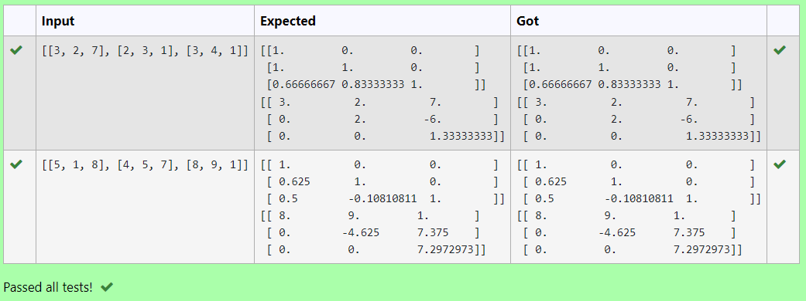

# 5. a) LU Decomposition without zero on the diagonal

## AIM:
To write a program to find the L and U matrix using LU Decomposition of a matrix.

## Equipments Required:
1. Hardware – PCs
2. Anaconda – Python 3.7 Installation / Moodle-Code Runner

## Algorithm
1. import numpy as np
2. From scipy package import lu
3. Get input from user
4. Print the result


## Program:
```
'''Program to find L and U matrix using LU decomposition.
Developed by: SRIJITH R
RegisterNumber: 21004191
'''

import numpy as np
from scipy.linalg import lu
A=eval(input())
P,L,U=lu(A)
print(L)

```

## Output:


## Result:
Thus the program to find the LU Decomposition of a matrix is written and verified using python programming.
___
___
___
# 5. b) LU Decomposition without zero on the diagonal

## AIM:
To write a program to find the solution of a matrix using LU Decomposition of a matrix.

## Equipments Required:
1. Hardware – PCs
2. Anaconda – Python 3.7 Installation / Moodle-Code Runner

## Algorithm
1. import numpy as np
2. From scipy package import lu_factor,lu_solve
3. Get input from user
4. Print the result


## Program:
```
'''Program to solve a matrix using LU decomposition.
Developed by: SRIJITH R
RegisterNumber: 21004191
'''

# To print X matrix (solution to the equations)

import numpy as np
from scipy.linalg import lu_factor, lu_solve
A=eval(input())
B=eval(input())
lu,piv=lu_factor(A)
x=lu_solve((lu, piv), B)
print(x)

```

## Output:


## Result:
Thus the program to find the solution of a matrix using LU decomposition is written and verified using python programming.
